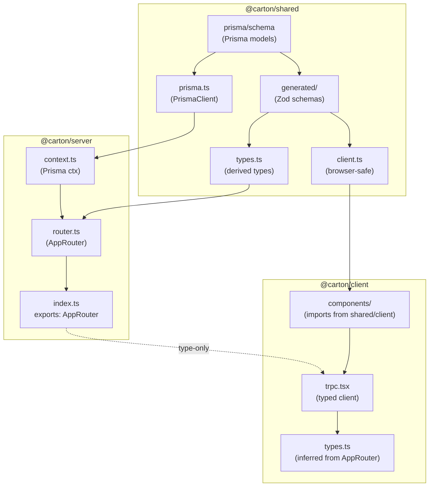

# Cross-Package Type Flow

This skill defines how TypeScript types flow between the three packages in this monorepo:
- `@carton/shared` - Prisma schema, generated types, browser-safe utilities
- `@carton/server` - tRPC router, API definitions, database operations
- `@carton/client` - React frontend, UI components

## Core Philosophy: Always Derive, Never Manually Define

**CRITICAL**: Types flow in one direction: `Prisma → Zod → tRPC → Client`

Every type in this codebase should be traceable back to the Prisma schema. This ensures:
- Single source of truth for data models
- Automatic type safety through the entire stack
- No manual type synchronization required

## Type Flow Architecture



## Key Principles

### 1. Prisma is the Single Source of Truth
- All data models are defined in `packages/shared/prisma/schema.prisma`
- Run `npm run db:generate` to create Prisma Client and Zod schemas
- **NEVER** manually define types that duplicate Prisma models

### 2. Schema Derivation Pattern
Always derive API schemas from generated base schemas using Zod methods:
- `.pick({...})` - Select specific fields
- `.omit({...})` - Remove specific fields
- `.extend({...})` - Add new fields
- `.partial()` - Make all fields optional

### 3. PRISMA_AUTO_FIELDS Helper
For create/update operations, use a helper to omit auto-generated fields:

```typescript
// packages/shared/src/helpers.ts
export const PRISMA_AUTO_FIELDS = {
  id: true,
  createdAt: true,
  updatedAt: true,
} as const;
```

### 4. Two Entry Points for Shared Package
- `@carton/shared` - Full exports including Prisma (server-only)
- `@carton/shared/client` - Browser-safe exports (no Prisma runtime)

### 5. AppRouter Types Flow from Server
- `AppRouter` type is defined in `@carton/server`
- Client imports `AppRouter` directly from server (type-only import)
- Use `inferRouterOutputs<AppRouter>` for API response types

### 6. No Circular Dependencies
- shared → (nothing)
- server → shared
- client → shared/client, server (type-only)

## Schema Derivation Examples

### Creating Input Schemas (Server)

```typescript
// packages/server/src/router.ts
import { CaseSchema, PRISMA_AUTO_FIELDS } from '@carton/shared';

// For creating a new case - omit auto-generated fields
const CaseCreateInputSchema = CaseSchema.omit({
  ...PRISMA_AUTO_FIELDS,
  caseNumber: true, // auto-generated on server
});

// For updating a case - partial fields, excluding id
const CaseUpdateInputSchema = CaseSchema.omit({
  ...PRISMA_AUTO_FIELDS,
}).partial();

// For queries with specific fields
const CaseListQuerySchema = CaseSchema.pick({
  status: true,
  priority: true,
}).partial();
```

### Form Schemas (Client)

```typescript
// packages/client/src/pages/CreateCasePage/schema.ts
import { CaseCreateInputSchema } from '@carton/shared/client';

// Form schema derived from API schema
export const CaseFormSchema = CaseCreateInputSchema.pick({
  title: true,
  description: true,
  priority: true,
});

export type CaseFormData = z.infer<typeof CaseFormSchema>;
```

### Extending Schemas

```typescript
// Adding validation to a derived schema
const CaseCreateWithValidationSchema = CaseSchema.omit({
  ...PRISMA_AUTO_FIELDS,
}).extend({
  title: z.string().min(3, 'Title must be at least 3 characters'),
  description: z.string().max(1000, 'Description too long'),
});
```

## Import Patterns

### Server Importing from Shared
```typescript
// packages/server/src/router.ts
import {
  CaseSchema,
  CaseStatusSchema,
  PRISMA_AUTO_FIELDS,
  prisma
} from '@carton/shared';
```

### Client Importing Browser-Safe Code from Shared
```typescript
// packages/client/src/components/SomeComponent.tsx
import {
  formatCaseNumber,
  CASE_STATUS_OPTIONS,
  CaseStatusSchema
} from '@carton/shared/client';
```

### Client Importing Types from Server
```typescript
// packages/client/src/components/CaseList/types.ts
import type { inferRouterOutputs } from '@trpc/server';
import type { AppRouter } from '@carton/server';

type RouterOutputs = inferRouterOutputs<AppRouter>;
export type CaseListItem = RouterOutputs['case']['list'][number];
```

### Client Creating tRPC Client
```typescript
// packages/client/src/lib/trpc.tsx
import { createTRPCReact } from '@trpc/react-query';
import type { AppRouter } from '@carton/server';

export const trpc = createTRPCReact<AppRouter>();
```

## Adding New Features

### When Adding a New Prisma Model

1. **Define in shared**: Add model to `packages/shared/prisma/schema.prisma`
2. **Generate types**: Run `npm run db:generate`
3. **Create derived schemas**: Use `.pick()`, `.omit()`, `.extend()` for API inputs
4. **Create router**: Add tRPC procedures in `packages/server/src/router.ts`
5. **Use in client**: Import `AppRouter` from server for type inference

### When Creating API Input Schemas

1. **Start with generated schema**: Import the base schema from `@carton/shared`
2. **Derive using Zod methods**: Use `.omit()` for create, `.partial()` for update
3. **Use PRISMA_AUTO_FIELDS**: Omit id/createdAt/updatedAt for inputs
4. **Add validation**: Use `.extend()` for custom validation rules

### When Adding Form Validation

1. **Import from shared/client**: Use browser-safe exports
2. **Derive from API schema**: Use `.pick()` to select form fields
3. **Add UI validation**: Use `.extend()` for client-specific rules
4. **Keep in sync**: Forms validate what API expects

## Common Mistakes to Avoid

### ❌ Don't: Manually define types that duplicate Prisma
```typescript
// WRONG - will get out of sync with Prisma schema
type CaseStatus = 'TO_DO' | 'IN_PROGRESS' | 'COMPLETED' | 'CLOSED';

interface Case {
  id: string;
  title: string;
  status: CaseStatus;
}
```

### ✅ Do: Import from generated schemas
```typescript
// CORRECT - auto-generated from Prisma
import { CaseSchema, CaseStatusSchema } from '@carton/shared';
import type { Case, CaseStatus } from '@carton/shared';
```

### ❌ Don't: Create input schemas from scratch
```typescript
// WRONG - duplicates Prisma schema fields
const CreateCaseInput = z.object({
  title: z.string(),
  description: z.string().optional(),
  status: z.enum(['TO_DO', 'IN_PROGRESS', 'COMPLETED', 'CLOSED']),
  priority: z.enum(['LOW', 'MEDIUM', 'HIGH', 'CRITICAL']),
});
```

### ✅ Do: Derive input schemas from base schemas
```typescript
// CORRECT - derived from generated schema
import { CaseSchema, PRISMA_AUTO_FIELDS } from '@carton/shared';

const CreateCaseInput = CaseSchema.omit({
  ...PRISMA_AUTO_FIELDS,
  caseNumber: true,
});
```

### ❌ Don't: Import Prisma in client code
```typescript
// WRONG - will break browser builds
import { prisma } from '@carton/shared';
```

### ✅ Do: Use the client entry point
```typescript
// CORRECT - browser-safe
import { formatCaseNumber, CaseStatusSchema } from '@carton/shared/client';
```

### ❌ Don't: Create circular dependencies
```typescript
// WRONG - shared importing from server
// packages/shared/src/types.ts
import type { AppRouter } from '@carton/server'; // CIRCULAR!
```

### ✅ Do: Import AppRouter in client only
```typescript
// CORRECT - client imports from server (type-only)
// packages/client/src/lib/trpc.tsx
import type { AppRouter } from '@carton/server';
```

## Type Inference Pattern

The recommended pattern for component types:

```typescript
// packages/client/src/components/CaseList/types.ts
import type { inferRouterOutputs } from '@trpc/server';
import type { AppRouter } from '@carton/server';

// Infer all router outputs
type RouterOutputs = inferRouterOutputs<AppRouter>;

// Create specific types for this component
export type CaseListItem = RouterOutputs['case']['list'][number];
export type CaseDetail = RouterOutputs['case']['getById'];

// Props interface using inferred types
export interface CaseListProps {
  cases?: CaseListItem[];
  onCaseSelect?: (caseItem: CaseListItem) => void;
}
```

This ensures types always match what the API actually returns, including proper Date → string serialization.

## Type Derivation Summary

| Need | Method | Example |
|------|--------|---------|
| Create input | `.omit({ ...PRISMA_AUTO_FIELDS })` | Remove id, createdAt, updatedAt |
| Update input | `.omit({ ...PRISMA_AUTO_FIELDS }).partial()` | All fields optional except auto-fields |
| Query params | `.pick({ field1, field2 }).partial()` | Select specific filterable fields |
| Form data | `CreateInput.pick({ field1, field2 })` | Subset of create input for forms |
| Response type | `inferRouterOutputs<AppRouter>['route']['method']` | Infer from tRPC router |
| Extend validation | `.extend({ field: z.string().min(3) })` | Add custom validation rules |
